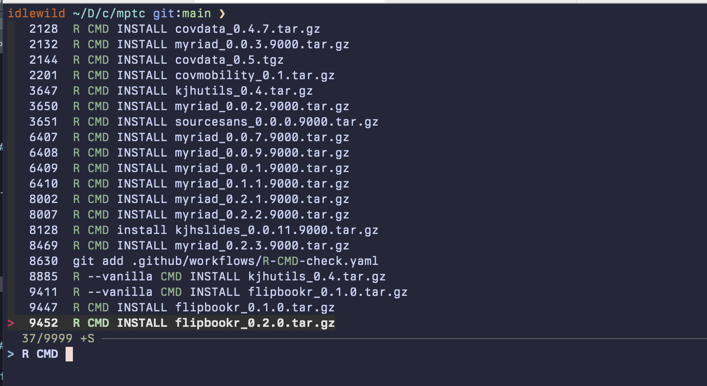
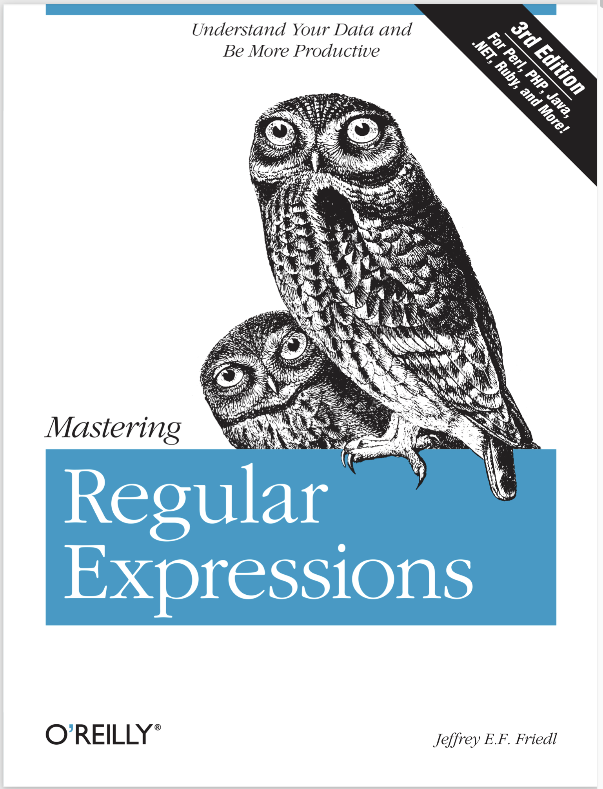

```{r}
#| label: setup
#| include: false

library(kjhslides)

kjh_register_tenso()
kjh_set_knitr_opts()
kjh_set_slide_theme()

library(flipbookr)
```


```{r}
#| echo: false

ansi_aware_handler <- function(x, options) {
  paste0(
    "<div class=\"cell-output cell-output-stdout\"><pre \"data-code-line-numbers\"><code>",
    fansi::to_html(x = htmltools::htmlEscape(x), warn = FALSE, term.cap = "256"),
    #cli::ansi_html(x = x),
    "</code></pre></div>"
  )
}

knitr::knit_hooks$set(
  output = ansi_aware_handler,
  message = ansi_aware_handler,
  warning = ansi_aware_handler,
  error = ansi_aware_handler
)

knitr::opts_chunk$set(engine.opts = list(zsh = "-l"))
```


# Getting around in the Shell

## Your command history

Eventually you will accumulate a history of shell commands you have typed, many of which you may want to reuse from time to time.

- Go to the previous command with the up arrow, `↑`
- _Search_ your command history with control-R, `^R`
- `^R` will also work for history search at the RStudio console and in many other places.


## Aside: Standard Modifier Key Symbols

| Symbol | Key       | Unicode  | Symbol | Key       | Unicode  |
|:------:|-----------|----------|:------:|-----------|----------|
| ⎋      | Escape    | `U+238B` | ⌫      | Backspace | `U+232B` |
| ⇥      | Tab       | `U+21E5` | ⌦      | Delete    | `U+2326` |
| ⇪      | Caps Lock | `U+21EA` | ⇱      | Home      | `U+21F1` |
| ⇧      | Shift     | `U+21E7` | ⇲      | End       | `U+21F2` |
| ⌃      | Control   | `U+2303` | ⇞      | Page Up   | `U+21DE` |
| ⌥      | Option/Alt| `U+2325` | ⇟      | Page Down | `U+21DF` |
| ⌘      | Command   | `U+2318` | ⌤      | Enter     | `U+2324` |
| ⏎      | Return    | `U+23CE` | ␣      | Space     | `U+2423` |

: {.striped}


# Searching inside files in the shell

## `grep`

`find` searches file and folder names only.  To search _inside_ files we use `grep`. Or rather we will use a flavor of grep called `egrep`.

```{zsh}
grep 'Stately' files/examples/ulysses.txt
```

Search more than one file:

```{zsh}
## -i for case-insensitive search
egrep -i 'jabber' files/examples/*.txt
```

## The `grep` family

grep and its derivatives are very powerful thanks to their ability to use _regular expressions_. We will learn about those momentarily. There are also more recent command-line search tools like ripgrep, or `rg`, a modern version of `grep` that is very fast, automatically searches subfolders, and has other nice additional features. For more details see the [ripgrep project page](https://github.com/BurntSushi/ripgrep).

```{.zsh}
# On a Mac with Homebrew (https://brew.sh)
brew install rg
```

## Integrate `rg` and `fzf`

`fzf` is a command-line fuzzy-finder. It makes `^R` really powerful and convenient. For details see the [fzf project page](https://github.com/junegunn/fzf).


```{.zsh}
# On a Mac
brew install fzf
```


{width=100%}


# Regular Expressions

## Regular Expressions

Or,

:::{.huge}
  [Waiter, there appears to be a language inside my language]{.fg-lblue}
:::

##  Regular Expressions

:::: {.columns}

::: {.column width="60%"}
  {width=70%}
:::

::: {.column width="40%" .right}
Regexps are their own world of text processing

  ☜ This book is a thing of beauty.
:::

::::


## We'll focus on R

We'll look at regular expressions via R, but most of the same things apply to the shell as well.

## Searching for patterns

::: {.incremental}
- A regular expression is a way of searching for a piece of text, or [pattern]{.fg-pink}, inside some larger body of text, called a [string]{.fg-red}.
- The simplest sort of search is like the "Find" functionality in a Word Processor. The pattern is a literal letter, number, punctuation mark, word or series of words; the strings are all the sentences in a document.
- When searching a plain-text file, our strings are the _lines_ of some plain text file. We search the file for some pattern and we want to see every line in the file where there is a match.
:::


## Why we use them

To _detect_ text, to _extract_ it, to _replace_ or _transform_ it.

## [stringr]{.fg-yellow} is your gateway to regexps in R

```{r }
#| label: "05-regular-expressions-4"
library(stringr) # It's loaded by default with library(tidyverse)
```

## Searching for patterns

A regular expression is a way of searching for a piece of text, or _pattern_, inside some larger body of text, called a _string_.

::::: {.fragment fragment-index=1}
The simplest sort of search is like the "Find" functionality in a Word Processor. The pattern is a literal letter, number, punctuation mark, word or series of words; the text is a document searched one line at a time. The next step up is "Find and Replace".

:::::

::::: {.fragment fragment-index=2}
Every pattern-searching function in `stringr` has the same basic form:

```r
str_view(<STRING>, <PATTERN>, [...]) # where [...] means "maybe some options"
```

:::::

::::: {.fragment fragment-index=3}

Functions that _replace_ as well as _detect_ strings all have this form:

```r
str_replace(<STRING>, <PATTERN>, <REPLACEMENT>)
```

:::::

::::: {.fragment fragment-index=4}
(If you think about it, [`<STRING>`]{.fg-orange}, [`<PATTERN>`]{.fg-orange} and [`<REPLACEMENT>`]{.fg-orange} above are all kinds of pattern: they are meant to "stand for" all kinds of text, not be taken literally.)
:::::


## Searching for patterns

- Here I'll follow the exposition in Wickham & Grolemund (2017). The
`str_view()` function just displays what your regexp will match in a given
string. In practice you will use functions that work in the same way but that
actually do something you want, like `str_detect()` `str_replace()`,
`str_extract()` or `str_squish()`. There are a lot of useful `str_` functions.

```{r }
#| label: "05-regular-expressions-5"

x <- c("apple", "banana", "pear")

str_view(x, "an")
```

## Searching for patterns


::: {.incremental}
- Regular expressions get their real power from _wildcards_, i.e. tokens that match more than just literal strings, but also more general and more complex patterns.
- The most general pattern-matching token is, "Match everything!" This is represented by the period, or [.]{.fg-pink}
- But ... if [.]{.fg-pink} matches any character, how do you specifically match the literal character [.]{.fg-green}?
:::


## Escaping

::: {.incremental}
- You have to "escape" the period to tell the regex you want to match it exactly, rather than interpret it as meaning "match anything".
- regexs use the backslash, [\\]{.fg-pink}, to signal "escape the next character".
- To match a [.]{.fg-green}, you need the regex [\\.]{.fg-pink}
:::


::: {.notes}
You need to use an “escape” to tell the regular expression you want to match it exactly, not use its special behaviour. Like strings, regexs use the backslash, [\\]{.fg-pink}, to escape special behaviour. So to match an [.]{.fg-pink}, you need the regex [\\.]{.fg-pink]. Unfortunately this creates a problem. We use strings to represent regular expressions, and \ is also used as an escape symbol in strings. So to create the regular expression \. we need the string "\\.".

:::


## Hang on, I see a further problem

- We use strings to represent regular expressions. [\\]{.fg-pink} is also used as an escape symbol in strings. So to create the regular expression [\\.]{.fg-pink} we need the string [\\\\\.]{.fg-pink}

```{r }
#| label: "05-regular-expressions-6"
# To create the regular expression, we need \\
dot <- "\\."

# But the expression itself only contains one:
writeLines(dot)

# And this tells R to look for an explicit .
str_view(c("abc", "a.c", "bef"), "a\\.c")
```


## But … how do you match a [literal]{.fg-yellow} [\\]{.fg-green}?

```{r }
#| label: "05-regular-expressions-7"

x <- "a\\b"
writeLines(x)
#> a\b

str_view(x, "\\\\") # you need four!

```

## But … how do you match a [literal]{.fg-yellow} [\\]{.fg-green}?

This is the price we pay for having to express searches for patterns using a language containing these same characters, which we may also want to search for.

---

:::{.huge}
  I _promise_ this will pay off
:::


## Matching start and end

- Use [\^]{.fg-pink} to match the start of a string.

```{r }
#| label: "05-regular-expressions-8"
x <- c("apple", "banana", "pear")
str_view(x, "^a")
```

## Matching start and end

- Use [\^]{.fg-pink} to match the start of a string.

```{r }
#| label: "05-regular-expressions-8b"
x <- c("apple", "banana", "pear")
str_view(x, "^a")
```

- Use [$]{.fg-pink} to match the end of a string.

```{r }
#| label: "05-regular-expressions-9"
str_view(x, "a$")
```

## Matching start and end

- To force a regular expression to only match a complete string, anchor it with both [\^]{.fg-pink} and [$]{.fg-pink}


```{r }
#| label: "05-regular-expressions-10"
x <- c("apple pie", "apple", "apple cake")
str_view(x, "apple")

```


```{r }
#| label: "05-regular-expressions-11"
str_view(x, "^apple$")
```

## Matching character classes

[\\d]{.fg-pink} matches any digit.

[\\s]{.fg-pink} matches any whitespace (e.g. space, tab, newline).

[abc]{.fg-pink} matches a, b, or c.

[\^abc]{.fg-pink} matches anything except a, b, or c.

::: {.notes}
Remember, to create a regular expression containing \d or \s, you’ll need to escape the \ for the string, so you’ll type "\\d" or "\\s".

:::


## Matching the [_special_]{.fg-yellow} characters

Look for a literal character that normally has special meaning in a regex:


```{r }
#| label: "05-regular-expressions-12"

str_view(c("abc", "a.c", "a*c", "a c"), "a[.]c")

```


```{r }
#| label: "05-regular-expressions-13"
str_view(c("abc", "a.c", "a*c", "a c"), ".[*]c")
```

This works for most (but not all) regex metacharacters: [$ . | ? * + ( ) \[ {]{.fg-pink}. Unfortunately, a few characters have special meaning even inside a character class and must be handled with backslash escapes. These are [\] \\ ^]{.fg-pink} and [-]{.fg-pink}

## Alternation

Use parentheses to make the precedence of the 'or' operator [**|**]{.fg-pink} clear:

```{r }
#| label: "05-regular-expressions-14"
str_view(c("groy", "grey", "griy", "gray"), "gr(e|a)y")
```

## Repeated patterns

- [?]{.fg-pink} is 0 or 1
- [+]{.fg-pink} is 1 or more
- [\*]{.fg-pink} is 0 or more

```{r }
#| label: "05-regular-expressions-15"
x <- "1888 is the longest year in Roman numerals: MDCCCLXXXVIII"
str_view(x, "CC?")
```

## Repeated patterns

- [?]{.fg-pink} is 0 or 1
- [+]{.fg-pink} is 1 or more
- [\*]{.fg-pink} is 0 or more

```{r }
#| label: "05-regular-expressions-16"
str_view(x, "CC+")
```

## Repeated patterns


- [?]{.fg-pink} is 0 or 1
- [+]{.fg-pink} is 1 or more
- [\*]{.fg-pink} is 0 or more


```{r }
#| label: "05-regular-expressions-17"
x <- "1888 is the longest year in Roman numerals: MDCCCLXXXVIII"
str_view(x, 'C[LX]+')
```

## Exact numbers of repetitions

- [{n}]{.fg-pink} is exactly n
- [{n,}]{.fg-pink} is n or more
- [{,m}]{.fg-pink} is at most m
- [{n,m}]{.fg-pink} is between n and m

```{r }
#| label: "05-regular-expressions-18"
str_view(x, "C{2}")
```

## Exact numbers of repetitions

- [{n}]{.fg-pink} is exactly n
- [{n,}]{.fg-pink} is n or more
- [{,m}]{.fg-pink} is at most m
- [{n,m}]{.fg-pink} is between n and m

```{r }
#| label: "05-regular-expressions-19"
str_view(x, "C{2,}")
```
## Exact numbers of repetitions

- [{n}]{.fg-pink} is exactly n
- [{n,}]{.fg-pink} is n or more
- [{,m}]{.fg-pink} is at most m
- [{n,m}]{.fg-pink} is between n and m

```{r }
#| label: "05-regular-expressions-20"
str_view(x, "C{2,3}")
```

## Exact numbers of repetitions

- [{n}]{.fg-pink} is exactly n
- [{n,}]{.fg-pink} is n or more
- [{,m}]{.fg-pink} is at most m
- [{n,m}]{.fg-pink} is between n and m

By default regexps use _greedy_ matches. You can make them match the _shortest_ string possible by putting a [?]{.fg-pink} after them. **This is often very useful!**

```{r }
#| label: "05-regular-expressions-21"
str_view(x, 'C{2,3}?')
```

## Exact numbers of repetitions

- [{n}]{.fg-pink} is exactly n
- [{n,}]{.fg-pink} is n or more
- [{,m}]{.fg-pink} is at most m
- [{n,m}]{.fg-pink} is between n and m

By default these are _greedy_ matches. You can make them “lazy”, matching the shortest string possible by putting a [?]{.fg-pink} after them. **This is often very useful!**

```{r }
#| label: "05-regular-expressions-22"
str_view(x, 'C[LX]+?')
```

## And [finally]{.fg-yellow} ... backreferences


```{r }
#| label: "05-regular-expressions-23"
fruit # built into stringr
```

## Grouping and backreferences

- Find all fruits that have a repeated pair of letters:

```{r }
#| label: "05-regular-expressions-24"
str_view(fruit, "(..)\\1", match = TRUE)
```

## Grouping and backreferences

- Backreferences and grouping will be very useful for string _replacements_.


## OK that was a [lot]{.fg-red}


# Application

`r chunq_reveal("05-regular-expressions-25", smallcode=TRUE, lcolw="60", rcolw="40", title = "Example: Politics and Placenames")`


```{r}
#| label: "05-regular-expressions-25"
#| include: FALSE
library(tidyverse)
library(ukelection2019)

ukvote2019 |>
  group_by(constituency) |>
  slice_max(votes) |>
  ungroup() |>
  select(constituency, party_name) |>
  mutate(shire = str_detect(constituency, "shire"),
         field = str_detect(constituency, "field"),
         dale = str_detect(constituency, "dale"),
         pool = str_detect(constituency, "pool"),
         ton = str_detect(constituency, "(ton$)|(ton )"),
         wood = str_detect(constituency, "(wood$)|(wood )"),
         saint = str_detect(constituency, "(St )|(Saint)"),
         port = str_detect(constituency, "(Port)|(port)"),
         ford = str_detect(constituency, "(ford$)|(ford )"),
         by = str_detect(constituency, "(by$)|(by )"),
         boro = str_detect(constituency, "(boro$)|(boro )|(borough$)|(borough )"),
         ley = str_detect(constituency, "(ley$)|(ley )|(leigh$)|(leigh )")) |>
  pivot_longer(shire:ley, names_to = "toponym")
```


## Example: Politics and Placenames

```{r}
#| label: "05-regular-expressions-26"
place_tab <- ukvote2019 |>
  group_by(constituency) |>
  slice_max(votes) |>
  ungroup() |>
  select(constituency, party_name) |>
  # We could write these more efficiently but we don't care about that rn
  mutate(shire = str_detect(constituency, "shire"),
         field = str_detect(constituency, "field"),
         dale = str_detect(constituency, "dale"),
         pool = str_detect(constituency, "pool"),
         ton = str_detect(constituency, "(ton$)|(ton )"),
         wood = str_detect(constituency, "(wood$)|(wood )"),
         saint = str_detect(constituency, "(St )|(Saint)"),
         port = str_detect(constituency, "(Port)|(port)"),
         ford = str_detect(constituency, "(ford$)|(ford )"),
         by = str_detect(constituency, "(by$)|(by )"),
         boro = str_detect(constituency, "(boro$)|(boro )|(borough$)|(borough )"),
         ley = str_detect(constituency, "(ley$)|(ley )|(leigh$)|(leigh )")) |>
  pivot_longer(shire:ley, names_to = "toponym")
```

---

```{r}
#| label: "05-regular-expressions-27"
#| include: FALSE
place_tab |>
  group_by(party_name, toponym) |>
  filter(party_name %in% c("Conservative", "Labour")) |>
  group_by(toponym, party_name) |>
  summarize(freq = sum(value)) |>
  mutate(pct = freq/sum(freq)) |>
  filter(party_name == "Conservative") |>
  arrange(desc(pct))

```

`r chunq_reveal("05-regular-expressions-27", smallcode=TRUE,  lcolw="50", rcolw="50", title = "Example: Politics and Placenames")`
